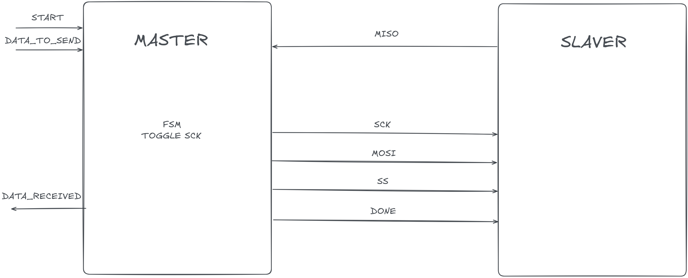
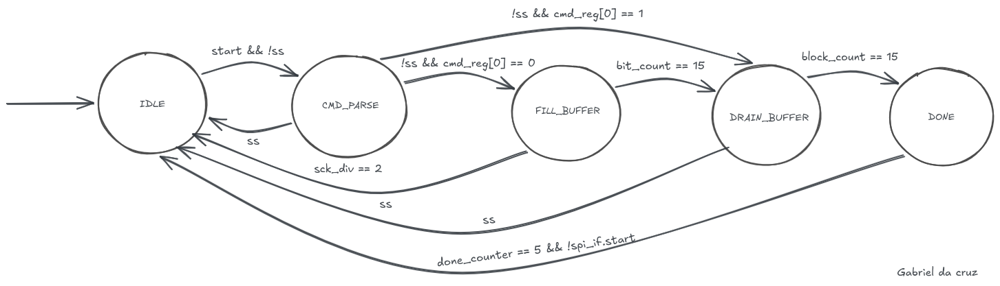
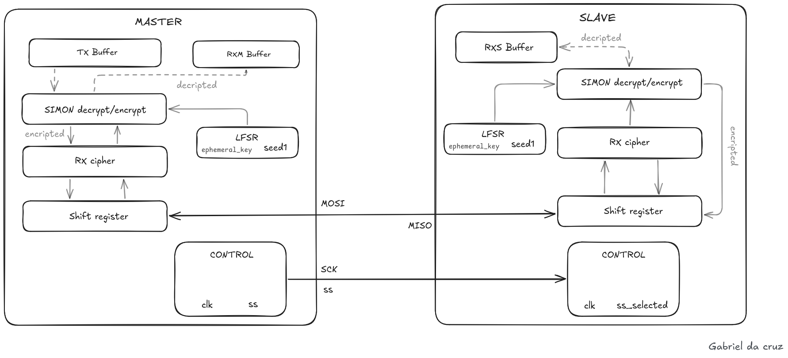
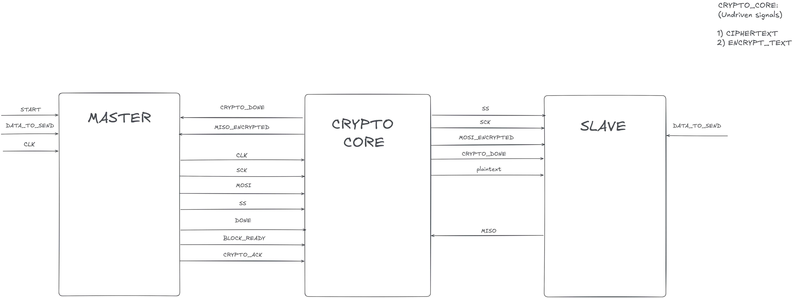
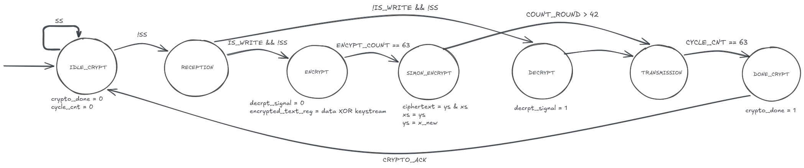
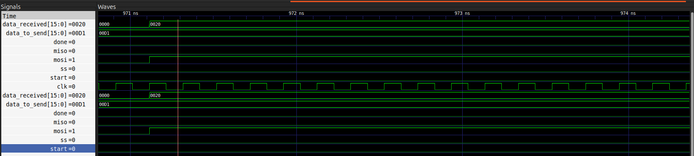
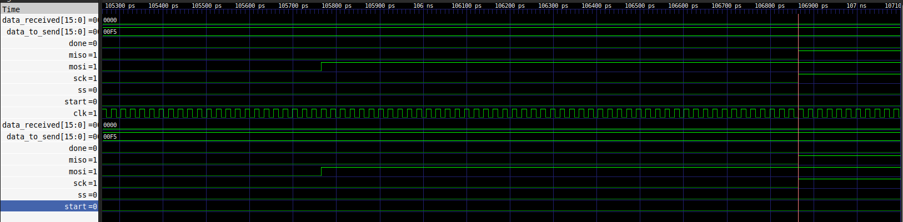
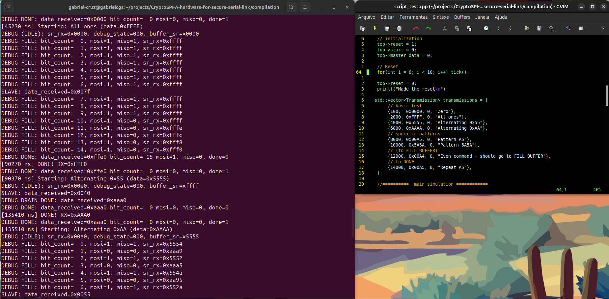
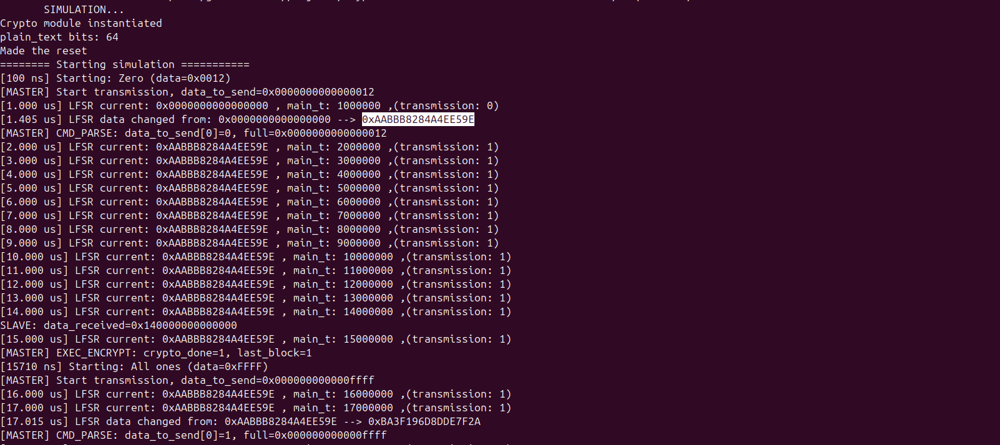

# Overview

The SPI is a full-duplex serial protocol which is used in short-distance to data transfers. The main architecture of this protocol involved a master block sending data to slavers with a handshake protocol.
It's widely used in,e.g, sensors, motherboard to transfer high important data. Moreover, it has been used extensively, such as Trusted Platform Module (TPM) that store and generate cryptographic keys.
However, the actual model of the security systems has been developed by proprietary company which the code and digital design are not publically available.
There are different kinds of TPMs and the major use is firware TPM (fTPM) which the control logic system runs involuntary inside of computer main processors, due to high-security exigencies some enterprise servers 
prefer to use a discrete TPM (dTPM) which is soldered onto the motherboard.
Hence, this project try to solve some emergency demand which ringes on of a open-source digital control system and application of classic/quantum cryptography in a most useful hardware communication protocol nowadays.

# Architecture
	
### High-Level digital design:




The system employs a classic Master-Slave topology:

- Master: Generates the clock (SCK) and manages the Slave Select (SS) signal. It is responsible for initializing the control block on the slave device and orchestrating data exchange.
- Slaver: Responds to the master's commands, processes cryptographic operations (LFSR/Simon), and manages bi-directional data flow via the shift register.

The primary data path connects the **Shift Register** to an internal **Buffer**, which is specifically designed to safely store incoming data. This separation ensures data integrity during transmission.

```plaintext
								+-------------+     SPI Bus     +--------------+
								|   Master    | <-------------> |    Slaver    |
								| (Clock Gen) |   (MOSI/MISO)   |  			   |
								|     		  |      		    |			   |
								|    T_x      |    (SCK/SS)     |	  R_x      |	
								|	  ->      |				    |	  ->	   |
								|	buffer    |				    |	 buffer	   |
								+-------------+                 +--------------+
										|                              |
										|-- Control & Initialization --|
```

### Six stage pipeline:

The processing flow is divided into six distinct stages to optimize throughput and timing:

1. Command Parsing (cmd_parse): Interprets incoming instructions from the master and determines the system's operational mode. It serves as the decision-making core.

2. Data Loading (fill_buffer): Acts as the receiver. It captures incoming data from the MISO line and stores it into the internal buffer. Manages the writing process into the internal buffer,
handling data alignment and LSB-first verification during the transmission state.

3. Data Unloading (drain_buffer): Acts as the sender. It retrieves data from the buffer and shifts it out onto the MOSI line.

5. Finalization: Manages the handshake back to the SPI interface for transmission.

### SPI finite state machine (FSM):



The digital control logic was made to be executed inside of master which controls the data flow and defines the behavior of the system. The FSM was implemented with 5 states:

1. IDLE: Asserts default signal values (`ss` high, `sck` low) and waits for the simulation start or external trigger to initiate the flow.

2. CMD_PARSE: Activates the slave by pulling `ss` low. Initializes the internal `sr_rx` buffer for the upcoming cycle. Moreover it reads the LSB of the command byte to dynamically 
branch into either a write (Master sends data) or read (Master receives data) operation.

3. FILL_BUFFER: Samples the `miso` line on specific clock edges. Observes the master's `sck` to synchronize serial data shifting and drives the `mosi` line with the next buffered bit, handling the transmission path.

4. DRAIN_BUFFER: adopt the reception mechanism which get the miso value and transfer from the shifter register to the buffer.

5. DONE: Deactivates the slave by driving `ss` high. Asserts the `done` flag, signaling transaction completion and readying the FSM to return to IDLE.

## Crypto digital architecture

The cryptographic core of this system was designed to establish a secure communication channel between the Master (SPI controller) and the Slave (peripheral device). The primary goal is to protect data in transit against common threats such as side-channel attacks, eavesdropping, and data tampering. It is a critical requirement in modern embedded systems.
As a real‑world use case, the adoption of hardware security (e.g, TPM 2.0 mandated by Microsoft) highlights the industry's push toward reliable, long‑term cryptographic solutions.



The first design approach embedded the cryptographic logic directly inside the Master and Slave modules. Both modules contained internal buffers and shift registers to load, store, and process data. The encryption/decryption relied on:

1) LFSR ephemeral key generator for keystream generation.
2) A Simon encryption/decryption block for lightweight symmetric cryptography.

Data was transferred via internal FIFO structures before being written to the output buffer.
Whereas, we realized critical problems, such as:
- Lack of data masking: Data was processed internally but not hidden from the SPI bus, exposing it to potential side‑channel attacks (e.g., power analysis, timing analysis).

- Scalability: embedding crypto logic inside every module increased complexity and made it difficult to adapt to different protocols or key lengths.

- Poor debugability: the design led to a high number of multi-driven signals and gate-delay issues, making RTL debugging time-consuming.

- High latency: architecture introduced data delay, due to redudant buffering and processing steps.

Hence we adopted a new architecture which master receive a miso encrypted and slaver receive mosi encrypted. Is built undriven signals, which shows the LFSR encription, Simon encription and description words. Even with additional complexity of adding new sincronous module with new a finite state machine, it becomes more scalable, due to a separation between RTL-design SPI module, which is universally adopted with a IP Core with a purpose of delivery secure data transference and cryptographic algorithms computation.



That brought key improvements:
- encrypted lines: The Master receives `miso_encrypted` (ciphertext), and the Slave receives `mosi_encrypted` (ciphertext), the raw SPI signals are never exposed outside the crypto core.

- better scalability: crypto core is independent of the SPI controller, making it reusable across different protocols and platforms.

- simplified debug: each module (SPI, Crypto, Slave) has a defined interface, reducing side‑effects and making the RTL easier to verify and maintain.

### Crypto finite state machine (FSM):



The crypto core is controlled by a 7 state FSM, ensuring reliable and deterministic transitions between data reception, processing, and transmission phases.

1. IDLE_CRYPT: Monitors the `ss` (Slave Select) signal. When `ss` goes low, the core transitions to `RECEPTION`.

2. RECEPTION: Captures serial data from Master (`mosi`) and Slave (`miso`) simultaneously, concatenating bits into 64‑bit words. Sets `is_write` flag based on the command LSB.

3. ENCRYPT: Generates a keystream using the LFSR (updated every cycle). Performs XOR with the plaintext to produce the LFSR encrypted data

4. SIMON_ENCRYPT: Applies the SIMON block cipher to the LFSR encrypted data. Performs key expansion (96 bit master key -> 42 round keys), executes 42 rounds of the SIMON round function (including rotations, bit‑wise AND, and XOR), and produces the final 64 bit ciphertext.

5. DECRYPT: decrypt SIMON with a keystream, followed by XOR with the LFSR keystream.

6. TRANSMISSION: Serializes the resulting ciphertext (or plaintext) bit‑bit and drives `mosi_encrypted` (to Slave) and `miso_encrypted` (to Master) based on the `is_write` flag.

7. DONE_CRYPT: Asserts the `crypto_done` signal, waits for the Master's `crypto_ack`, then returns to `IDLE_CRYPT`.

# Waveform analyses



A comprehensive set of test cases was executed to validate the architectural behavior and signal integrity of the system. The test was designed to process six independent transmissions, with a total simulation time sufficient to cover all data patterns defined in the testbench.



The original system was configured for Master‑to‑Slave communication. At 106.9 ns, the following events were observed:

- activation of the internal SPI clock `sck`.
- assertion of the `miso` line (data from slaver to master).
- transition of the control signal `ss`, which triggers the start of a transaction.

The measured propagation delay through the crypto pipeline is approximately 1.1 ns, which is for the combinational logic and register setup times.

The start signal remains active for 400 clock cycles – a deliberate design choice that ensures the Slave has sufficient time to:

- Detect falling edge of `ss`.
- Prepare its iternal register and shift buffers.
- Stabilize its outputs before first data bit is sampled.

The total time required to transmit a complete data block is denoted as T_total.

``` 
T_total = N_bits * T_bit ->  24 bits * (10 ns) -> T_total = 240 ns
```


# Installing and compilation

The project includes a dedicated compilation script, run_verl.sh, which automates the entire RTL verification pipeline. This script performs the following steps:

1. Compilation: Uses Verilator to compile the SystemVerilog RTL sources and the C++ testbench.

2. Simulation: Executes the testbench and generates a waveform dump (Cryptwave.vcd) for in‑depth analysis.

3. Logging: Captures console output, including FSM state transitions, bit‑level SPI activity, and crypto engine logs.



The encrypted data (ciphertext) produced by the SIMON engine is also preserved in internal registers throughout the entire cycle, ensuring that it remains available for subsequent operations (e.g., future encryption rounds, or for Slave decryption). This storage strategy minimises data movement and helps maintain consistency across the system.



## Compilation

Firstly, urge to clone the repository in your desktop:

```bash
git clone git@github.com:MathParamount/CryptoSPI-A-hardware-for-secure-serial-link.git
```

The easiest way to compile and execute the simulation is:

```bash
cd ./CryptoSPI-A-hardware-for-secure-serial-link
cd compilation
chmod +x run_verl.sh
./run_verl.sh
```

The script automatically:

1. Compiles the SystemVerilog sources using Verilator.
2. Compiles the C++ testbench.
3. Links the generated executable.
4. Runs the simulation.
5. Generates the waveform file (`wave.vcd` in main branch, but `Cryptwave.vcd` in crypto_release).

Wait until the compilation finishes successfully. The terminal will display simulation logs and test information.

After a successful execution, open the generated waveform and analyse in GTKWave.

### Simulation

The C++ testbench (`sim_run_cpp/script_test.cpp`) is responsible for:

- Applying reset sequences.
- Generating the system clock.
- Sending transactions.
- Monitoring the DUT outputs.
- Producing the `wave.vcd` file for waveform analysis.

# Observations

...

# Status (development)

- SPI architecture design (completed)

- RTL SPI (completed)

- Testbench & waveform SPI (completed)

- SPI + crypto architecture (completed)

- crypto digital control logic (completed)

- LFSR implementation (completed)

- LFSR key mix SIMON (In progress)

- Documentation SPI RTL (In progress)

- Formal verification (In progress)

- SVA (In progress)

- Validation architecture with side-channel attacks (In progress)

- FPGA implementation (In progress)

- side-channel attacks (power analyses, time analyses,...) in FPGA (In progress)

- Universal Handshake protocol to multiple slavers (In progress)

- Site creation looking to documentation, real case use, call to action (In progress)

# Conclusion

The development of this project has demonstrated the feasibility of integrating a robust cryptographic core into an SPI communication system, ensuring data confidentiality and integrity during transmission between Master and Slave.

In this project was built a hybrid cryptography combining:
- LFSR for ephemeral keystream generation.

- SIMON64/96 as a lightweight block cipher, with 42 rounds and 96‑bit key expansion.

- Robust handshake between Master and Crypto using crypto_done and crypto_ack signals, eliminating race conditions and infinite loops.

- Full validation with 4 test scenarios (including the official SIMON test vector), achieving 100% pass rate for both encryption and decryption tests.

The project successfully achieved all its objectives, delivering a secure, scalable, and verifiable SPI communication system. The combination of LFSR and SIMON proved effective for embedded applications, balancing security and performance.
